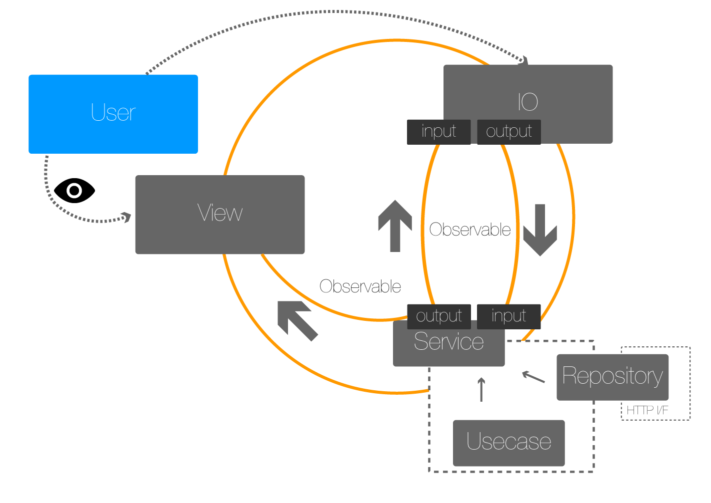

# react-mvi
Minimal framework for react + rxjs mvi architecture

inspired by
[cyclejs](http://cycle.js.org/)
[react-combinators](https://github.com/milankinen/react-combinators)  
[react-reactive-toolkit](https://github.com/milankinen/react-reactive-toolkit)

## Guide

- Examples
    - [Simple Counter Programe](./docs/basic_guide.md)
    - [Single Page Application with react-router](./docs/spa.md)
- Basics
    - [Setup](./docs/setup.md)
    - [Create component with context](./docs/basics/create_component.md)
    - [Create service](./docs/basics/create_service.md)
    - [IO modules](./docs/basics/io_modules.md)
    - [DI Container](./docs/basics/di_container.md)
- Advanced Usage
    - [Create your own IO modules.](./docs/au/create_yowim.md)
    - [Share injector](./docs/au/share_injector.md)

## Architecture

## Requirements

- jspm > 0.17.0-beta.16

## Modules

- [@react-mvi/core](modules/core)
- [@react-mvi/http](modules/http)
- [@react-mvi/event](modules/event)
