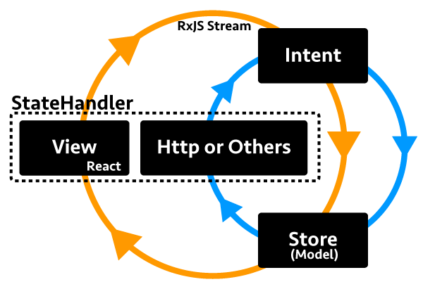

# react-mvi

react-mvi is Model-View-Intent based minimal framework with Reactjs and RxJS.

- We remove all `shouldComponentUpdate` from React by create each props as RxJS.Observable.
- We built more redux user friendly Model-View-Intent framework than [cyclejs](http://cycle.js.org/).
- Asynchronous process is no more problem, StateHandler make it easy and clean.
- Command line tool has been prepared! as `@react-mvi/cli`

Inspired by  
[cyclejs](http://cycle.js.org/)  
[redux](https://github.com/reactjs/redux)  
[react-combinators](https://github.com/milankinen/react-combinators)  
[react-reactive-toolkit](https://github.com/milankinen/react-reactive-toolkit)

## First look !

```javascript

import * as React from 'react';
import { Observable } from 'rxjs/Rx';
import { Tags as T, store, intent, connect } from '@react-mvi/core';

/**
 * Intent is converter that convert dispatched event to Observable.
 */
@intent
class Intent {
  plus() { return this.intent.for('counter::plus').share();}

  minus() { return this.intent.for('counter::minus').share(); }
}

/**
 * Store is Observable state factory.
 */
@store
class Store {
  initialize() {
    return {
      view: {
        counter: this.intent.plus().mapTo(1)
          .merge(this.intent.minus().mapTo(-1))
          .scan((acc, e) => {
            return acc + e;
          }, 0)
      }
    };
  }
}

/**
 * Root component must decorated by connect like redux.
 */
@connect({
  mapIntentToProps(intent) {
    return {
      onPlus: intent.callback('counter::plus'),
      onMinus: intent.callback('counter::minus'),
    }
  }
})
class View extends React.Component {
  render() {
    return (
      <div>
        <button onClick={this.props.onPlus}>Plus</button>
        <button onClick={this.props.onMinus}>Minus</button>
        /* We can treat Observable value directly. */
        <T.Div>conter value is {this.props.counter}</T.Div>
      </div>
    );
  }
}

render(
  <Provider intent={Intent} store={Store}><View /></Provider>,
  document.querySelector('#app')
);

```

## Installation and setup


```
npm install @react-mvi/cli -g
rmvi init
```


## Guide

- Examples
    - [Simple Counter Programe](./docs/basic_guide.md)
    - [Single Page Application with react-router](./docs/spa.md)
- Basics
    - [Setup](./docs/setup.md)
    - [Create connected component](./docs/basics/create_connected_component.md)
    - [Create component with context](./docs/basics/create_component.md)
    - [Create store](./docs/basics/create_store.md)
    - [Create intent](./docs/basics/create_intent.md)
    - [StaeHandler](./docs/basics/state_handler.md)
- Advanced Usage
    - [Create your own StateHandler](./docs/au/create_yow_state_handler.md)

## Architecture



## Requirements

- react >= 15.0.0 <= 15.6.1
- react-dom >= 15.0.0 <= 15.6.1
- rxjs >= 5.0.0 <= 5.4.2

## Modules

- [@react-mvi/core](modules/core)
- [@react-mvi/http](modules/http)
- [@react-mvi/testing](modules/testing)
- [@react-mvi/cli](modules/cli)
